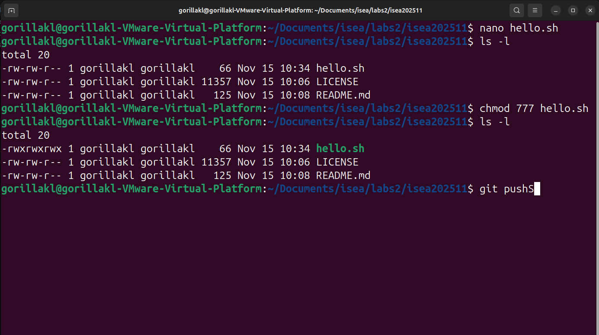

The purpose of this repository is to provide the students with a guide to the above course.

 
My Labs are as follows:
<ol>
  <li><a href="Lab_01.md">Lab 1</a></li>
</ol>
 

Another screenshot to be added

Second screenshot

My other screenshot coming in

TADA

